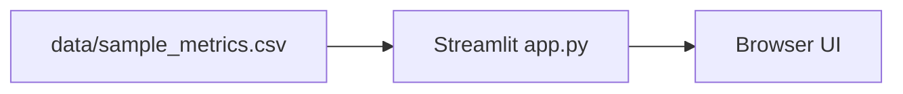

# Architecture — Golden Signal Dashboard

## Purpose

The **Golden Signal Dashboard** is a lightweight academic monitoring front end that visualizes Google SRE **four golden signals** (latency, traffic, errors, saturation) over time, using batch-style metrics stored in CSV format. It is intended to demonstrate how observability data can be consumed, interpreted with thresholds, and presented in a single pane of glass.

## Logical components

| Component | Role |
|-----------|------|
| **Metrics file** (`data/sample_metrics.csv`) | Source of truth for demo metrics: per-service time series. |
| **Dashboard app** (`app.py`, Streamlit) | Loads CSV with Pandas, filters by service and time window, renders Plotly charts and health summaries. |
| **Data generator** (`utils/generate_sample_data.py`) | Regenerates synthetic but plausible metrics for labs and CI. |
| **Container image** (`Dockerfile`) | Reproducible runtime: Python 3.11, dependencies, Streamlit on port **8501**. |
| **CI** (`.github/workflows/ci.yml`) | Installs dependencies and runs `pytest` on push/PR. |
| **Puppet** (`puppet/`) | Sample configuration management: writes a small deployment-oriented config file from parameters (category alignment). |

## Data flow

In a production setting, CSV would be replaced by a metrics backend (for example Prometheus or a time-series database). This project deliberately keeps ingestion simple for coursework.

## Health model

Row-level health is derived from **latency (p95)**, **error rate**, and **CPU saturation** against fixed thresholds defined in `app.py` and documented in `implementation.md`. **Traffic** is treated as informational (higher traffic is not automatically “bad” without context).

## Security boundary (academic scope)

The app serves read-only metrics from a local file bundled with the image or working copy. There is no authentication layer in scope; any production deployment would place the app behind an identity-aware reverse proxy.
